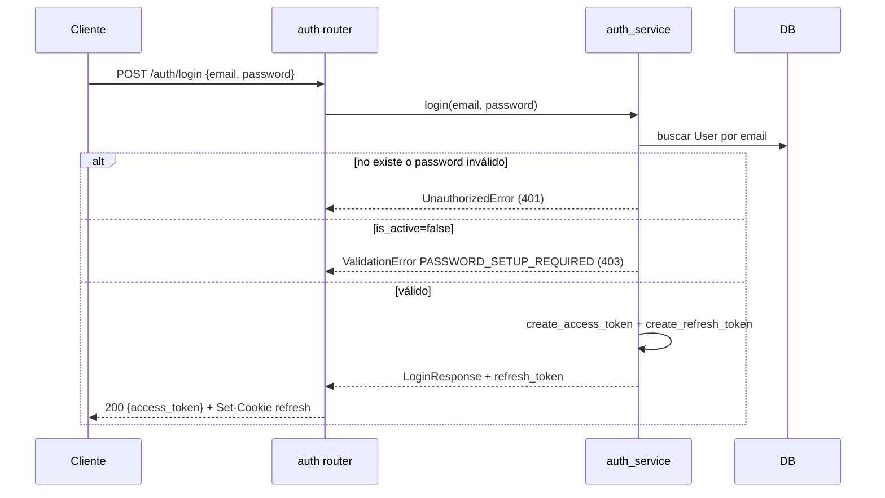
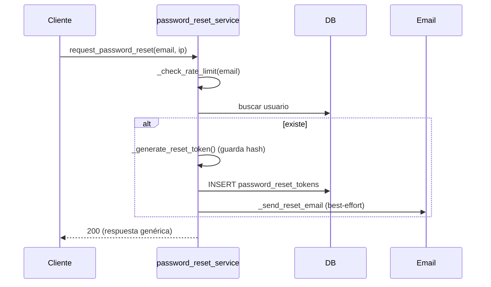
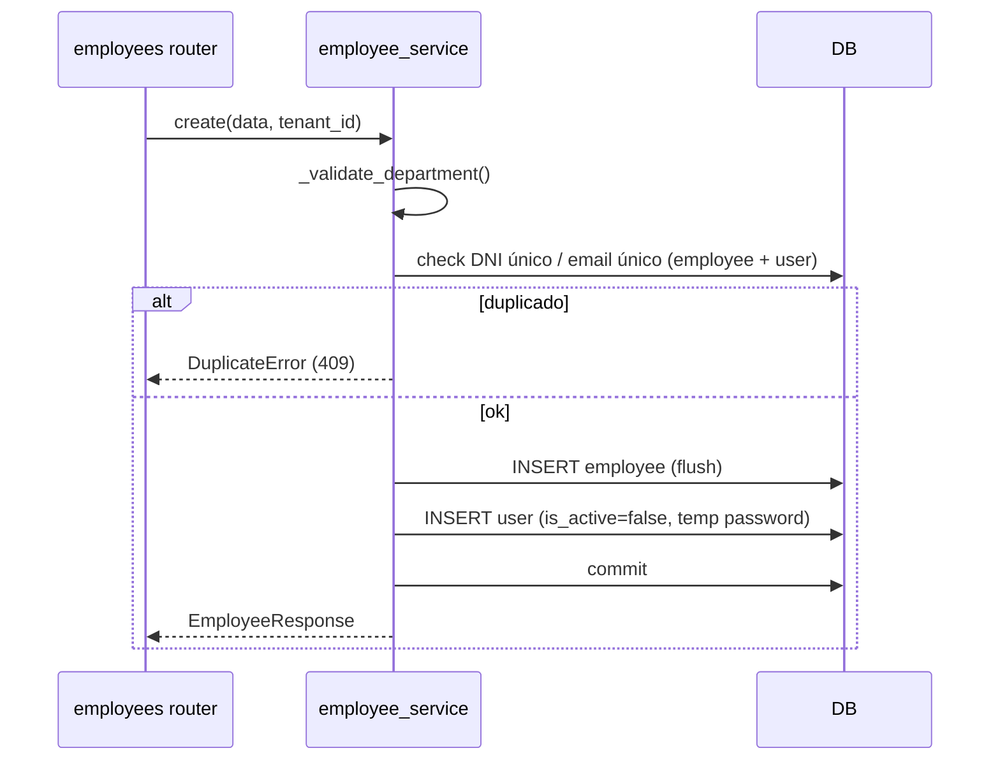
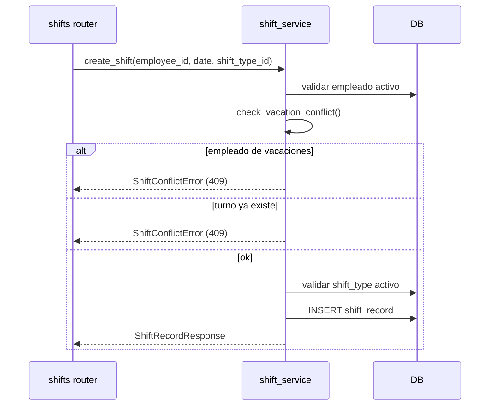
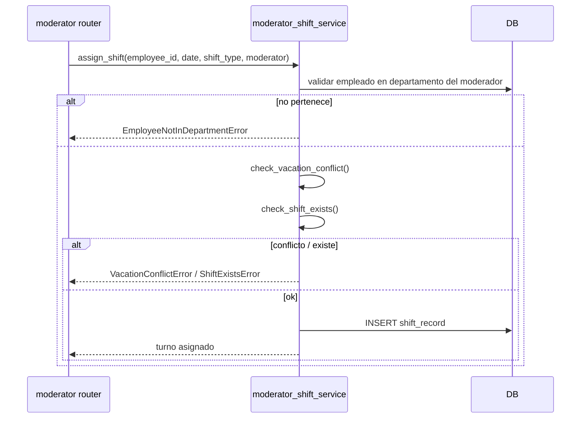
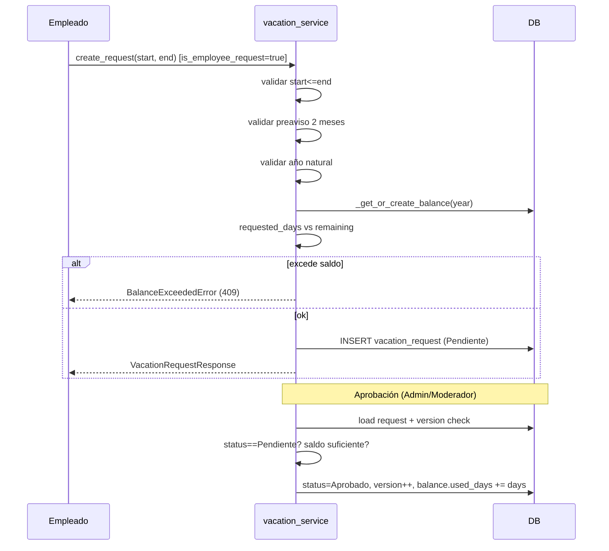
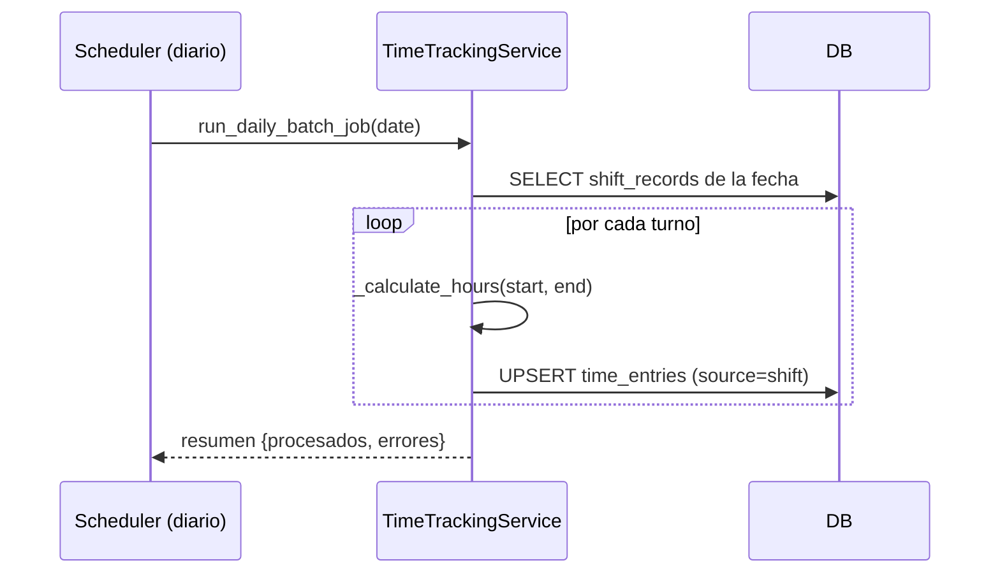

# Documentación del Backend — ILPI Kitchen Staff Management

> **Fuente**: `backend/app/` (excluye `backend/alembic/`, documentado en `../db/`)
> **Última actualización**: 2026-06-28

API REST construida con **FastAPI + SQLModel** siguiendo **Clean Architecture**:
las dependencias apuntan hacia adentro `Routers → Services → Models`.

---

## 1. Arquitectura por capas

```
Cliente HTTP
    │
    ▼
┌─────────────────────────────────────────────────┐
│ Routers  (app/routers/)                          │  HTTP: serialización, status,
│   - Solo HTTP, sin lógica de negocio             │  checks de rol (require_role)
├─────────────────────────────────────────────────┤
│ Schemas  (app/schemas/)  — DTOs Pydantic v2      │
├─────────────────────────────────────────────────┤
│ Services (app/services/)                         │  Toda la lógica de negocio:
│   - Validación, mutaciones, reglas de dominio    │  RBAC, invariantes, queries
├─────────────────────────────────────────────────┤
│ Models   (app/models/)   — Entidades SQLModel    │
└─────────────────────────────────────────────────┘
    │
    ▼
PostgreSQL
```

**Componentes transversales** (`app/common/`): `enums.py`, `exceptions.py`
(jerarquía `DomainError`), `schemas.py`, `security.py` (JWT, bcrypt),
`email_service.py`, `audit`/`time_tracking` exceptions, `department_icons.py`.

**Infraestructura**: `config.py` (pydantic-settings), `database.py` (sesión),
`dependencies.py` (DI), `main.py` (factory, middleware), `seed.py`, `jobs/scheduler.py`.

---

## 2. Configuración de la aplicación (`main.py`)

- **Prefijo global**: `/api/v1`. Endpoint de salud: `GET /health`.
- **CORS**: orígenes explícitos desde `settings.cors_origins_list` (sin wildcard).
- **Cabeceras de seguridad** (middleware): `X-Content-Type-Options: nosniff`,
  `X-Frame-Options: DENY`, `Strict-Transport-Security`,
  `Content-Security-Policy: default-src 'self'`, `Referrer-Policy`.
- **Rate limiting** (`slowapi`): `10/minute` en login y reset; `20/minute` en verify.
- **Middleware de auditoría**: registra eventos sensibles (login, logout, CRUD de
  empleados/usuarios, acciones de vacaciones) y accesos denegados (401/403).
- **Scheduler** (APScheduler): job diario de time tracking (por defecto 01:00),
  desactivable con `DISABLE_SCHEDULER`.
- **Manejo global de errores**: mapeo `DomainError → HTTP status`.

### Mapeo de excepciones → HTTP

| Excepción | HTTP |
|-----------|------|
| `NotFoundError` | 404 |
| `UnauthorizedError` | 401 |
| `ForbiddenError` | 403 |
| `ValidationError`, `AdvanceNoticeRequiredError` | 400 |
| `DuplicateError`, `ConflictError`, `BalanceExceededError`, `ShiftTypeInUseError` | 409 |
| `InvalidShiftTypeError` | 422 |
| código `PASSWORD_SETUP_REQUIRED` | 403 |

---

## 3. Seguridad y RBAC

### Autenticación (`common/security.py`)
- **JWT HS256**. Access token: **30 min** (`ACCESS_TOKEN_EXPIRE_MINUTES`).
  Refresh token: **7 días** (`REFRESH_TOKEN_EXPIRE_DAYS`), entregado en cookie.
- **Passwords**: `bcrypt` vía passlib (`CryptContext`).
- Blacklist en memoria de refresh tokens (MVP; en producción usar Redis).

### Dependencias de autorización (`dependencies.py`)
- `get_current_user`: valida `Authorization: Bearer <token>`.
- `get_current_tenant`: extrae `tenant_id` del JWT.
- **`require_role(*roles)`**: comprueba solo el rol.
- **`require_role_and_active(*roles)`**: comprueba rol **y** `user.is_active=true`
  (bloquea usuarios que aún no completaron el setup de contraseña).

### Matriz de RBAC (resumen)

| Recurso | Admin | Moderador | Empleado |
|---------|:-----:|:---------:|:--------:|
| Usuarios (`/users`) | ✅ | ❌ | ❌ |
| Departamentos (`/departments`) | ✅ | ❌ | ❌ |
| Empleados — listar/ver | ✅ | ✅ | ✅ |
| Empleados — crear/editar | ✅ | ✅ | ❌ |
| Empleados — borrar/reactivar | ✅ | ❌ | ❌ |
| Tipos de turno (`/shift-types`) | ✅ (write) | ✅ (read) | ❌ |
| Equipos (`/teams`) | ✅ | ✅ | ❌ |
| Roster (`/rosters/shifts`) write | ✅ | ✅ | ❌ |
| Mis turnos (`/employee/shifts/*`) | ❌ | ❌ | ✅ (+active) |
| Vacaciones — aprobar/rechazar | ✅ | ✅ | ❌ |
| Mis vacaciones (`/employee/vacation-*`) | ❌ | ❌ | ✅ (+active) |
| Portal moderador (`/moderator/*`) | ❌ | ✅ (+active) | ❌ |
| Dashboard / Informes | ✅ | ✅ | ❌ |
| Métricas de personal (`/reports/{overtime-ratio,overtime-ranking,absenteeism,vacation-liability}`) | ✅ | ❌ | ❌ |
| Configuración (`/settings`) | ✅ | parcial | ❌ |
| Horas extra / ausencias | ✅ | ✅ | ❌ |

---

## 4. Catálogo de endpoints

> Todos bajo el prefijo `/api/v1`.

### Auth (`routers/auth.py`)
| Método | Ruta | Rate limit | Descripción |
|--------|------|-----------|-------------|
| POST | `/auth/login` | 10/min | Login (devuelve access + refresh cookie) |
| POST | `/auth/refresh` | — | Renueva tokens |
| POST | `/auth/logout` | — | Invalida refresh token |
| POST | `/auth/password-setup` | — | Alta de contraseña vía token |

### Password reset (`routers/password_reset_router.py`)
| Método | Ruta | Rate limit |
|--------|------|-----------|
| POST | `/auth/password-reset/request` | 10/min |
| GET | `/auth/password-reset/verify` | 20/min |
| POST | `/auth/password-reset/verify` | 5/min |

### Users (`routers/users.py`) — **Admin**
`GET/POST /users`, `PUT/DELETE /users/{user_id}`.

### Departments (`routers/departments.py`) — **Admin**
`GET/POST /departments`, `GET/PUT /departments/{id}`,
`GET /departments/{id}/delete-preview`, `DELETE /departments/{id}` (con reasignación).

### Employees (`routers/employees.py`)
`GET /employees` (todos), `POST /employees` (Admin/Mod),
`GET /employees/{id}`, `PUT /employees/{id}` (Admin/Mod),
`DELETE /employees/{id}` (Admin), `POST /employees/{id}/activate` (Admin).

### Shift types (`routers/shift_types.py`)
`GET /shift-types` (Admin/Mod), `POST/PUT /shift-types` (Admin),
`DELETE /shift-types/{id}` (Admin).

### Teams (`routers/teams.py`) — Admin/Mod (delete: Admin)
`GET/POST /teams`, `GET/PUT/DELETE /teams/{id}`,
`POST /teams/{id}/members`, `DELETE /teams/{id}/members/{employee_id}`.

### Shifts / Roster (`routers/shifts.py`)
`GET /shifts`, `GET /rosters/shifts` (todos los roles);
`POST /rosters/shifts`, `POST /rosters/shifts/bulk`,
`PUT/DELETE /rosters/shifts/{id}` (Admin/Mod);
`GET /employee/shifts/{month,today,upcoming}` (Empleado + active).

### Vacations (`routers/vacations.py`)
`GET /vacations`, `POST /vacations`,
`PUT /vacations/{id}/{approve,reject,cancel}` (Admin/Mod),
`GET /vacations/balance/{employee_id}` (todos),
`GET/POST /employee/vacation-*` y cancel (Empleado + active).

### Moderator portal (`routers/moderator.py`) — **Moderador + active**, prefijo `/moderator`
`GET /roster`, `GET /shifts`, `GET /vacations/pending`, `GET /vacations/{id}`,
`POST /vacations/{id}/{approve,reject}`, `POST /shifts/assign`,
`PUT/DELETE /shifts/{id}`, `GET /reports/{vacations,attendance}`.

### Dashboard (`routers/dashboard.py`) — Admin/Mod
`GET /dashboard/stats`, `GET /reports/hours-by-day`, `GET /reports/department-distribution`.

### Personnel metrics (`routers/metrics.py`) — **Admin** (Feature 015)
Agregaciones de solo lectura para la sección "Métricas de Personal" de Informes.
RBAC en doble capa: `require_role("Admin")` en el router + check explícito en
`services/metrics_service.py`. Todo filtrado por `tenant_id`.
| Método | Ruta | Descripción |
|--------|------|-------------|
| GET | `/reports/overtime-ratio` | Ratio horas extra vs. ordinarias del periodo (`ratio_pct` null sin ordinarias) |
| GET | `/reports/overtime-ranking` | Top N empleados por horas extra (`limit` 1–50, default 10) |
| GET | `/reports/absenteeism` | Tasa de absentismo (ausencias/turnos planificados) con desglose y `alert` >5% |
| GET | `/reports/vacation-liability` | Pasivo de vacaciones devengado por empleado activo + totales (`year` opcional) |

### Time tracking (`routers/time_tracking.py`) — prefijo `/employee/time-tracking`
`GET /statistics` (Empleado + active) y endpoints de horas extra/estadísticas
(Admin/Mod para creación/borrado).

### Settings (`routers/settings.py`) — prefijo `/settings`
`GET/PUT /vacations` (Admin), `GET /audit-log` (Admin).

---

## 5. Servicios: lógica, restricciones y diagramas de secuencia

Cada servicio concentra la lógica de negocio. A continuación, las **reglas/restricciones**
y un **diagrama de secuencia** del flujo principal.

### 5.1 `auth_service`
**Funciones**: `login`, `refresh`, `logout`, `setup_password`.

**Restricciones**:
- Login rechaza credenciales inválidas (`UnauthorizedError`).
- Si el usuario no completó el setup (`is_active=false`), error `PASSWORD_SETUP_REQUIRED`.
- `setup_password`: las contraseñas deben coincidir; mínimo 8 caracteres, mayúsculas/
  minúsculas y números; el token debe existir y no estar expirado; el token es de un solo uso.



### 5.2 `password_reset_service`
**Métodos**: `request_password_reset`, `verify_token`, `verify_and_reset_password`.

**Restricciones**:
- **No revela** si un email existe (responde igual exista o no).
- **Rate limiting**: ventana de 10 min entre solicitudes y máximo 5/día por email.
- Token almacenado como **SHA256** (`token_hash`), expira en **24h**, **single-use**.
- Validación de fortaleza de contraseña. El envío de email no bloquea la respuesta
  (best-effort, no lanza excepción si falla).



### 5.3 `user_service`
**Funciones**: `create_user`, `list_users`, `update_user`, `deactivate_user`.
**Restricciones**: email único (`DuplicateError DUPLICATE_EMAIL`); 404 si no existe.

### 5.4 `employee_service`
**Funciones**: `create`, `list_employees`, `get_by_id`, `update`, `soft_delete`, `activate_employee`.

**Restricciones**:
- Departamento debe existir, pertenecer al tenant y estar activo.
- DNI y email únicos por tenant (en `employee` **y** email único en `user`).
- `passport` es opcional (sin restricción de unicidad); se persiste solo si el empleado indica que posee pasaporte.
- Al crear, se genera un `User` asociado con `is_active=false` (pendiente de setup).
- **Soft delete** solo Admin (`ForbiddenError` si no): marca `Inactivo`, desactiva el
  user asociado y **auto-rechaza** solicitudes de vacaciones pendientes.
- **Reactivar** solo Admin.



### 5.5 `department_service`
**Funciones**: `ensure_system_department`, `list_departments`, `get_by_id`, `create`,
`update`, `get_delete_preview`, `delete_with_reassign`.

**Restricciones**:
- Nombre único case-insensitive por tenant (`ConflictError`).
- Departamentos `is_system` no se pueden modificar/borrar (`ForbiddenError`).
- Borrar = **soft-delete** + **reasignar** empleados y equipos al departamento del sistema.
- `ensure_system_department` crea idempotentemente "Sin asignar".

### 5.6 `team_service`
**Funciones**: `create`, `list_teams`, `get_by_id`, `update`, `delete`,
`add_member`, `remove_member`.

**Restricciones**:
- Departamento válido y activo; `shift_type` existente y activo.
- Combinación `(tenant, name, department)` única (`DuplicateError`).
- `add_member`: no se puede añadir un empleado **de vacaciones** (`EMPLOYEE_ON_VACATION`).

### 5.7 `shift_type_service`
**Funciones**: `create`, `list_shift_types`, `get_by_id`, `update`, `delete`.

**Restricciones**:
- 1 a 3 ventanas horarias; start/end no pueden ser iguales.
- `expected_hours` validadas (rango y coherencia con ventanas).
- Nombre único por tenant (`DuplicateError`).

### 5.8 `shift_service` (roster)
**Funciones**: `list_shifts`, `get_shifts_for_month`, `create_shift`,
`create_shifts_bulk`, `update_shift`, `delete_shift`, `get_employee_*` (month/today/upcoming).

**Restricciones**:
- Empleado debe existir y estar activo.
- **Conflicto con vacaciones**: no se asigna turno si el empleado está de vacaciones
  aprobadas (`ShiftConflictError`).
- **Sin duplicados**: un solo turno por empleado/fecha/tipo (índice de roster).
- `shift_type` debe existir y estar activo.
- Carga masiva: `start_date <= end_date`; valida tipo de turno.
- Control de acceso: empleados solo ven sus propios turnos (`_check_access`).



### 5.9 `moderator_shift_service`
**Funciones**: `get_department_roster`, `assign_shift`, `update_shift`, `delete_shift`,
`get_shifts_for_date`, `get_vacation_status_for_date`, helpers de validación.

**Restricciones** (scope por departamento del moderador):
- El moderador solo opera sobre **su** departamento (`ForbiddenError` / `EmployeeNotInDepartmentError`).
- No asignar turno con conflicto de vacaciones (`VacationConflictError`).
- No duplicar turnos (`ShiftExistsError`).
- No borrar un turno ya trabajado (`check_shift_worked` → `ValidationError`).



### 5.10 `moderator_service`
**Funciones**: `get_moderator_department`, `enforce_department_scope`,
`get_attendance_report`, `get_vacation_summary`.

**Restricciones**: deriva el departamento del moderador desde el JWT (`employee_id`);
`enforce_department_scope` impide acceder a empleados de otros departamentos (`ForbiddenError`).

### 5.11 `vacation_service`
**Funciones**: `create_request`, `approve`, `reject`, `cancel`, `get_balance`,
`list_requests`, `get_request_by_id`, `get_department_pending_requests`,
`get_vacation_request_details`.

**Restricciones**:
- `start_date <= end_date`.
- **Preaviso de 2 meses** para solicitudes de empleado (`AdvanceNoticeRequiredError`).
- Confinadas al **año natural** (antes del 31 dic) — `CALENDAR_YEAR_VIOLATION`.
- Días = `(end - start).days + 1` (días naturales).
- No exceder el saldo disponible (`BalanceExceededError`), validado al crear y al aprobar.
- **Optimistic locking** vía `version` (`ConflictError` si cambió).
- Solo se aprueban/rechazan/cancelan solicitudes **Pendiente**.
- Empleado solo cancela sus **propias** solicitudes pendientes (`ForbiddenError`).
- Aprobar incrementa `vacation_balance.used_days`.



### 5.12 `time_tracking_service`
**Clase** `TimeTrackingService` + `run_daily_batch_job`.
**Funciones**: generación automática de `time_entries` desde turnos
(`generate_time_entries_for_date`, `process_workdays_for_month`),
`create_extra_hours`, `delete_extra_hours`, estadísticas
(`get_employee_statistics`, `get_department_statistics`, `get_time_entries`).

**Restricciones**:
- Cálculo de horas maneja turnos nocturnos (cruce de medianoche).
- Generación **idempotente** (unique constraint evita duplicados).
- Horas extra: solo **Admin/Moderador** (`ForbiddenError`); validan empleado y datos.
- El batch diario registra errores pero **no lanza** (para no detener el scheduler).



### 5.13 `absence_service`
**Clase** `AbsenceService`: `create_absence`, `delete_absence`, `list_absences`,
`count_absences_for_period`.
**Restricciones**: crear/borrar ausencias solo **Admin/Moderador** (`ForbiddenError`);
empleado debe existir; unicidad por `(tenant, employee, date)`.

### 5.14 `dashboard_service`
**Funciones**: `get_stats`, `get_hours_by_day`, `get_department_distribution`.
Agregaciones de solo lectura para Admin/Moderador.

### 5.15 `settings_service`
**Funciones**: `get_vacation_settings`, `update_vacation_settings`.
Gestiona `tenant.default_vacation_days`. 404 si no existe el tenant.

### 5.16 `audit_service`
**Función**: `log(...)` — inserta registros en `audit_log` (append-only) para eventos
relevantes (p. ej. cambios de `custom_vacation_days`, acciones de configuración).

---

## 6. Datos iniciales (`seed.py`)

Crea el tenant **ILPI** (`slug="ilpi"`), un catálogo de departamentos por defecto, y
tres usuarios de ejemplo:

| Email | Rol | Estado |
|-------|-----|--------|
| `admin@ilpi.es` | Admin | activo (password `Admin123!`) |
| `moderador@ilpi.es` | Moderador | activo (password `Moderador123!`) |
| `empleado@ilpi.es` | Empleado | activo (password `Empleado123!`) |

> Credenciales solo para desarrollo/seed local.

---

## 7. Calidad

```bash
cd backend
mypy app --strict     # Tipado estricto (cero errores)
ruff check .          # Linting (py312, line-length=100)
pytest                # Tests
pytest --cov=app      # Cobertura
```
