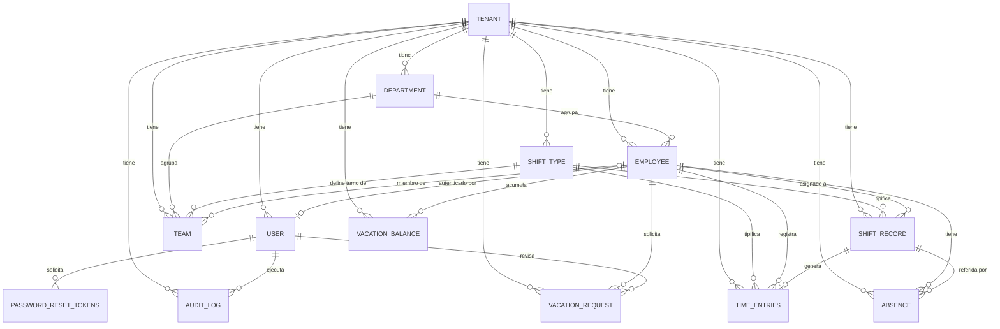

# Documentación de Base de Datos — ILPI Kitchen Staff Management

> **Fuente**: `backend/app/models/` (entidades SQLModel) y `backend/alembic/versions/` (migraciones)
> **Motor**: PostgreSQL 16 · **ORM**: SQLModel (SQLAlchemy + Pydantic) · **Migraciones**: Alembic
> **Última actualización**: 2026-06-28

Este documento describe el modelo de datos completo: tablas, columnas, claves,
restricciones (constraints), índices, relaciones y la historia de migraciones.

---

## 1. Visión general

El sistema es **multi-tenant** (preparado para múltiples organizaciones, aunque el
MVP opera con un único tenant `ILPI`). **Cada entidad de negocio incluye `tenant_id`**
como clave foránea hacia `tenant.id`, lo que permite aislar datos por organización.

Todas las claves primarias son **UUID** (`uuid4`) y la mayoría de tablas incluyen
`created_at` / `updated_at` (timestamps UTC).

### Mapa de entidades

| Tabla | Propósito |
|-------|-----------|
| `tenant` | Organización contenedora (configuración global, días de vacaciones por defecto) |
| `user` | Credenciales de autenticación (email, hash de password, rol) |
| `employee` | Ficha personal/profesional del empleado |
| `department` | Departamento (ABM, color, icono, sistema) |
| `team` | Equipo dentro de un departamento, asociado a un tipo de turno |
| `shift_type` | Plantilla de tipo de turno (ventanas horarias, horas esperadas) |
| `shift_record` | Asignación / registro de turno de un empleado en una fecha |
| `time_entries` | Horas trabajadas (generadas automáticamente o horas extra) |
| `absence` | Ausencia de un empleado en una fecha |
| `vacation_request` | Solicitud de vacaciones (con estado) |
| `vacation_balance` | Saldo de vacaciones por empleado y año |
| `password_reset_tokens` | Tokens de recuperación de contraseña (hash, single-use) |
| `audit_log` | Bitácora de auditoría append-only |

---

## 2. Diagrama Entidad-Relación



---

## 3. Detalle de tablas

### 3.1 `tenant`
Organización contenedora; raíz de la jerarquía multi-tenant.

| Columna | Tipo | Notas |
|---------|------|-------|
| `id` | UUID | PK |
| `name` | varchar(100) | Nombre de la organización |
| `slug` | varchar(50) | **UNIQUE** |
| `timezone` | str | Por defecto `Europe/Madrid` |
| `locale` | str | Por defecto `es` |
| `is_active` | bool | Por defecto `true` |
| `default_vacation_days` | int | Por defecto `30` — base para el saldo de vacaciones |
| `created_at` / `updated_at` | datetime | UTC |

### 3.2 `user`
Credenciales de autenticación. Puede o no estar vinculado a un `employee`.

| Columna | Tipo | Notas |
|---------|------|-------|
| `id` | UUID | PK |
| `tenant_id` | UUID | FK → `tenant.id`, indexado |
| `email` | varchar(255) | Único por tenant (`uq_user_tenant_email`) |
| `hashed_password` | str \| null | **Nullable** durante el flujo de alta (setup de contraseña) |
| `role` | str | `Admin`, `Moderador`, `Empleado` |
| `employee_id` | UUID \| null | FK → `employee.id`, **UNIQUE** |
| `is_active` | bool | `false` hasta que el usuario complete el setup de contraseña |
| `password_reset_token` | str \| null | UNIQUE (flujo de setup, Feature 005) |
| `password_reset_expires` | datetime \| null | Expiración del token |
| `last_login` | datetime \| null | Auditoría |
| `last_password_reset_request_at` | datetime \| null | Rate limiting (10 min) |
| `password_reset_attempt_count` | int | Límite diario (5/día) |

**Constraint clave**: `UniqueConstraint(tenant_id, email)`.

### 3.3 `employee`
Ficha completa del empleado.

| Columna | Tipo | Notas |
|---------|------|-------|
| `id` | UUID | PK |
| `tenant_id` | UUID | FK → `tenant.id`, indexado |
| `first_name` / `last_name` | varchar(100) | |
| `email` | varchar(255) | Único por tenant (`uq_employee_tenant_email`) |
| `phone` | varchar(20) \| null | |
| `dni` | varchar(20) | Único por tenant (`uq_employee_tenant_dni`) |
| `address` | varchar(500) \| null | |
| `birth_date` | date \| null | |
| `marital_status` / `gender` | str \| null | |
| `role` | str | Rol funcional |
| `department_id` | UUID | **FK → `department.id`**, indexado |
| `status` | str | `Activo` por defecto (`Activo`/`Vacaciones`/`Ausente`/`Inactivo`) |
| `hire_date` | date | Obligatoria |
| `profile_image` | varchar(500) \| null | |
| `emergency_contact` | varchar(255) \| null | |
| `is_active` | bool | Soft-delete (ver §5) |
| `custom_vacation_days` | int \| null | Override de días de vacaciones del empleado |
| `team_id` | UUID \| null | FK → `team.id` |

**Constraints**: `UniqueConstraint(tenant_id, dni)`, `UniqueConstraint(tenant_id, email)`.

### 3.4 `department`
Catálogo de departamentos (ABM, Feature 014).

| Columna | Tipo | Notas |
|---------|------|-------|
| `id` | UUID | PK |
| `tenant_id` | UUID | FK → `tenant.id`, indexado |
| `name` | varchar(60) | Único case-insensitive por tenant (índice funcional) |
| `description` | varchar(255) \| null | |
| `color` | varchar(7) | Hex `#RRGGBB`, por defecto `#6b7280` |
| `icon` | varchar(40) | Nombre de icono Lucide, por defecto `Building2` |
| `is_system` | bool | Departamento del sistema ("Sin asignar") — no editable/borrable |
| `is_active` | bool | Soft-delete |

**Constraints / índices**:
- `CheckConstraint(color ~ '^#[0-9a-fA-F]{6}$')` — `ck_department_color_hex`
- `Index(tenant_id, is_active)`, `Index(tenant_id, is_system)`

### 3.5 `team`
Equipo dentro de un departamento, asociado a un `shift_type`.

| Columna | Tipo | Notas |
|---------|------|-------|
| `id` | UUID | PK |
| `tenant_id` | UUID | FK → `tenant.id`, indexado |
| `shift_type_id` | UUID | FK → `shift_type.id`, indexado |
| `name` | varchar(100) | |
| `department_id` | UUID | FK → `department.id`, indexado |
| `is_active` | bool | |

**Constraint**: `UniqueConstraint(tenant_id, name, department_id)` — `uq_team_tenant_name_dept`.

### 3.6 `shift_type`
Plantilla de tipo de turno (Mañana, Noche, Cortado, Corrido…).

| Columna | Tipo | Notas |
|---------|------|-------|
| `id` | UUID | PK |
| `tenant_id` | UUID | FK → `tenant.id`, indexado |
| `name` | varchar(100) | Único por tenant (`uq_shift_type_tenant_name`) |
| `type` | varchar(20) | |
| `time_windows` | JSON | Array de `{start: "HH:MM", end: "HH:MM"}` (máx. 3 ventanas) |
| `uses_dynamic_close` | bool | Turno con cierre dinámico |
| `expected_hours` | float | `CHECK (>= 0.5 AND <= 24.0)` |
| `description` | varchar(500) \| null | |
| `is_active` | bool | |

**Constraints / índices**: `UniqueConstraint(tenant_id, name)`,
`CheckConstraint(expected_hours)`, índices en `(tenant_id, is_active)` y `(tenant_id, name)`.
Propiedad calculada `total_hours` (maneja turnos que cruzan medianoche).

### 3.7 `shift_record`
Asignación/registro de un turno de un empleado en una fecha. Soporta planificación
(roster) y fichaje.

| Columna | Tipo | Notas |
|---------|------|-------|
| `id` | UUID | PK |
| `tenant_id` | UUID | FK → `tenant.id`, indexado |
| `employee_id` | UUID | FK → `employee.id`, indexado |
| `date` | date | Indexado (consultas de roster) |
| `shift_type_id` | UUID \| null | FK → `shift_type.id`, indexado |
| `entry_time` / `exit_time` | datetime \| null | Opcionales (nulos en asignación de roster) |
| `location_lat` / `location_lng` | float \| null | Geolocalización de fichaje |
| `task_label` | str \| null | |
| `created_by` | UUID \| null | FK → `user.id` (quién asignó el turno) |

**Constraints / índices** (de migraciones): índice único de roster
`uq_shift_record_roster`, índices `(tenant_id, employee_id, date)` y `(tenant_id, date)`.

### 3.8 `time_entries`
Horas trabajadas. Generadas automáticamente desde `shift_record` o cargadas como
horas extra por Admin/Moderador.

| Columna | Tipo | Notas |
|---------|------|-------|
| `id` | UUID | PK |
| `tenant_id` | UUID | FK → `tenant.id`, indexado |
| `employee_id` | UUID | FK → `employee.id`, indexado |
| `shift_date` | date | Indexado |
| `start_time` / `end_time` | time \| null | Nulos para horas extra (`source=extra`) |
| `hours_worked` | Decimal(5,2) | Duración en horas |
| `source` | enum | `shift` (auto), `manual` (legacy/futuro), `extra` (overtime) |
| `note` | varchar(255) \| null | Motivo/nota (horas extra) |
| `shift_record_id` | UUID \| null | FK → `shift_record.id` |
| `shift_type_id` | UUID \| null | FK → `shift_type.id` |

**Constraint**: `UniqueConstraint(tenant_id, employee_id, shift_date, shift_type_id)`
— `uq_time_entry_employee_date_shift`. Índices `(tenant_id, employee, date)` y `(tenant_id, date)`.

### 3.9 `absence`
Ausencia de un empleado en una fecha.

| Columna | Tipo | Notas |
|---------|------|-------|
| `id` | UUID | PK |
| `tenant_id` | UUID | FK → `tenant.id`, indexado |
| `employee_id` | UUID | FK → `employee.id`, indexado |
| `date` | date | Indexado |
| `shift_record_id` | UUID \| null | FK → `shift_record.id` |
| `justified` | bool | Ausencia justificada |
| `reason` | varchar(255) \| null | |
| `created_by` | UUID \| null | FK → `user.id` |

**Constraint**: `UniqueConstraint(tenant_id, employee_id, date)` — `uq_absence_employee_date`.

### 3.10 `vacation_request`
Solicitud de vacaciones con control de concurrencia optimista (`version`).

| Columna | Tipo | Notas |
|---------|------|-------|
| `id` | UUID | PK |
| `tenant_id` | UUID | FK → `tenant.id`, indexado |
| `employee_id` | UUID | FK → `employee.id`, indexado |
| `start_date` / `end_date` | date | |
| `requested_days` | int | Días naturales solicitados (inclusivo) |
| `status` | str | `Pendiente` / `Aprobado` / `Rechazado` / `Cancelado` |
| `reviewed_by` | UUID \| null | FK → `user.id` |
| `reviewed_at` | datetime \| null | |
| `version` | int | **Optimistic locking** (por defecto 1) |

### 3.11 `vacation_balance`
Saldo de vacaciones por empleado y año.

| Columna | Tipo | Notas |
|---------|------|-------|
| `id` | UUID | PK |
| `tenant_id` | UUID | FK → `tenant.id`, indexado |
| `employee_id` | UUID | FK → `employee.id`, indexado |
| `year` | int | |
| `total_days` | int | Por defecto 30 |
| `used_days` | int | Por defecto 0 |

**Constraint**: `UniqueConstraint(tenant_id, employee_id, year)` — `uq_balance_tenant_employee_year`.

### 3.12 `password_reset_tokens`
Tokens single-use y con expiración para recuperación de contraseña.

| Columna | Tipo | Notas |
|---------|------|-------|
| `id` | UUID | PK |
| `tenant_id` | UUID | FK → `tenant.id`, indexado |
| `user_id` | UUID | FK → `user.id`, indexado |
| `token_hash` | varchar(255) | **SHA256** del token (nunca en claro), indexado |
| `expires_at` | datetime | 24h desde creación, indexado |
| `used_at` | datetime \| null | Marca de uso (NULL = no usado) |
| `ip_address` | varchar(45) | IPv4/IPv6 solicitante (auditoría) |

### 3.13 `audit_log`
Bitácora de auditoría append-only.

| Columna | Tipo | Notas |
|---------|------|-------|
| `id` | UUID | PK |
| `tenant_id` | UUID | FK → `tenant.id` |
| `entity_type` | varchar(100) | Tipo de entidad afectada |
| `entity_id` | varchar(100) | ID de la entidad |
| `action` | varchar(100) | Acción realizada |
| `old_value` / `new_value` | str \| null | Estado anterior/nuevo |
| `changed_by` | UUID | FK → `user.id` |

**Índices**: `(tenant_id)`, `(tenant_id, entity_type, entity_id)`, `(tenant_id, created_at)`.

---

## 4. Enumeraciones

Definidas en `backend/app/common/enums.py` y en los strings de estado:

- **ShiftTypeEnum**: `MAÑANA`, `NOCHE`, `CORTADO`, `CORRIDO`
- **RosterShiftType**: `morning`, `afternoon`, `night`
- **TimeEntrySource**: `shift`, `manual`, `extra`
- **Roles** (string en `user.role` / `employee.role`): `Admin`, `Moderador`, `Empleado`
- **Estado de empleado** (`employee.status`): `Activo`, `Vacaciones`, `Ausente`, `Inactivo`
- **Estado de vacaciones** (`vacation_request.status`): `Pendiente`, `Aprobado`, `Rechazado`, `Cancelado`

---

## 5. Reglas e invariantes a nivel de datos

- **Unicidad por tenant**: DNI y email son únicos por tenant tanto en `employee` como
  en `user` (email).
- **Soft delete**: borrar un empleado pone `is_active=false` / `status=Inactivo`
  (preserva históricos). Lo mismo para departamentos (`is_active=false`).
- **Vacaciones en días naturales**: `requested_days = (end - start).days + 1`
  (incluye fines de semana y festivos), confinadas al año natural.
- **Concurrencia optimista**: `vacation_request.version` evita actualizaciones perdidas.
- **Departamento del sistema**: existe un departamento `is_system=true` ("Sin asignar")
  al que se reasignan empleados/equipos cuando se elimina un departamento.
- **Generación de horas idempotente**: `uq_time_entry_employee_date_shift` evita duplicar
  registros de horas para el mismo turno.

---

## 6. Historia de migraciones (Alembic)

Cadena de migraciones en orden de aplicación (`backend/alembic/versions/`):

| # | Revision | Descripción |
|---|----------|-------------|
| 1 | `82db0c2710d3` | Migración inicial: `tenant`, `team`, `employee`, `shift_record`, `user`, `vacation_balance`, `vacation_request` |
| 2 | `2aca5d9f21d0` | Añade tabla `shift_type` |
| 3 | `9db3d4f10fe2` | Integra `shift_type` con `team` (FK) |
| 4 | `4ca5a273db07` | Puebla `shift_type_id` para equipos existentes (data migration) |
| 5 | `ab0bd6eec523` | Elimina columnas de turno antiguas de `team` (`shift_type`, `shift_start`, `shift_end`) |
| 6 | `20260305_roster_fields` | Añade campos de roster a `shift_record` (`shift_type`, `created_by`; `entry/exit_time` opcionales) |
| 7 | `20260306_shift_type_fk` | Reemplaza string `shift_type` por FK `shift_type_id` en `shift_record` |
| 8 | `f5e9c1a2b3d4` | Añade campos de setup de contraseña a `user` |
| 9 | `e7f2d5c4a1b6` | Añade tabla `time_record` (Feature 005, fichaje manual) |
| 10 | `34bd6356fba6` | Añade `password_reset_tokens` y campos de rate limiting en `user` |
| 11 | `79ad9726ce5e` | Crea tabla `time_entries` (time tracking automático) |
| 12 | `20260605_extra_hours` | Elimina `time_record`; añade soporte de horas extra a `time_entries` |
| 13 | `20260616_add_absence` | Añade tabla `absence` |
| 14 | `20260625_vacation_config` | Config de vacaciones (`tenant.default_vacation_days`, `employee.custom_vacation_days`) + tabla `audit_log` |
| 15 | `20260626_departments` | Añade tabla `department` y migra `employee`/`team` de string a FK |

> **Nota**: el `head` actual de la cadena es `20260626_departments`.

### Comandos útiles

```bash
cd backend
alembic upgrade head          # Aplicar todas las migraciones
alembic downgrade -1          # Revertir la última
alembic revision --autogenerate -m "descripcion"   # Nueva migración
alembic history               # Ver historia
```
